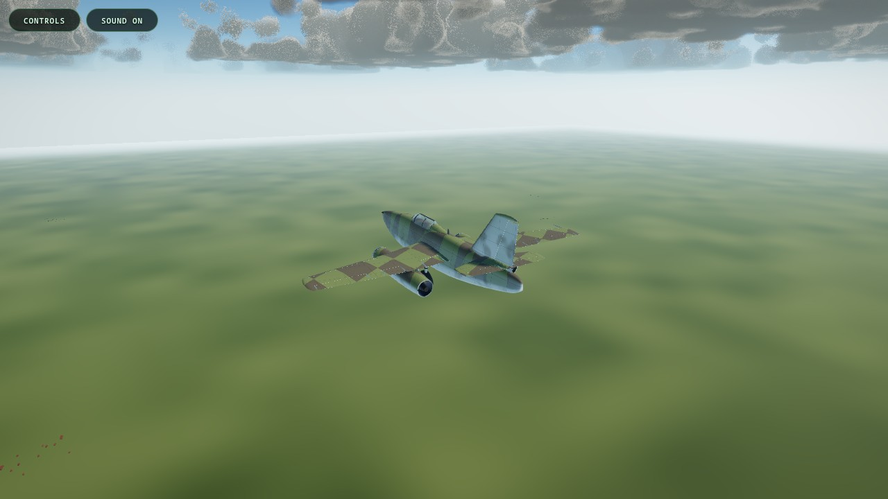
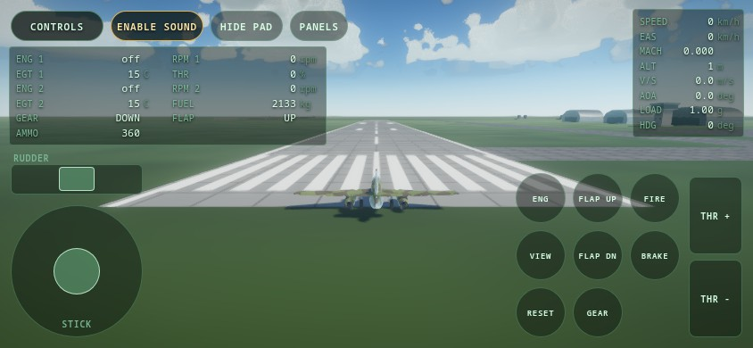

# web-flight-sim

A flight simulator of the Messerschmitt Me-262 A-1a, in TypeScript, in the
browser.



The flight model builds the total force and moment from separate parts. It sums
twenty two lifting strips, three bodies, two engines, three landing gear legs
and seven airframe contact points. It carries no table of aircraft level
coefficients. The roll damping, the dihedral effect, the asymmetric stall, the
Mach tuck and the fuel consumption all come OUT of the model. They go into the
tests as measurements.

The physics runs at a fixed 240 Hz step and holds no browser code. The same
model therefore runs in the browser and in a Node test harness. 26 flight tests
hold 31 measurements against published data and against the class bands of a
fighter of the period.

## Fly it

The simulator runs on GitHub Pages at
<https://sean-mcconnachie.github.io/web-flight-sim/>. It needs a browser with
WebGPU or WebGL 2. A phone works: the page draws its own controls when it sees a
touch screen.

`.github/workflows/deploy.yml` builds and publishes the page. It runs the type
check, the unit tests and the flight tests first. A broken flight model
therefore cannot reach the site.


The virtual cockpit carries fifteen live instruments. It builds itself on the
first frame in that view, so a flight that never uses the view never pays for
it.


## Turn the sound up

The simulator ships no audio file. Every sound is built at run time out of the
same numbers the flight model holds.

The engine is three sources and not one, because a turbojet is three sources.
The exhaust roar follows the eighth power of the jet velocity, which is
Lighthill's law. It is therefore everything at full power and nothing at idle.
The combustion follows the fuel flow, and it is what is left at idle. The
compressor tone is the blade passing frequency of the first stage. It reads
3.9 kHz at 8700 rpm and it sweeps down with the rotor.

There is no pitch calculation anywhere in the sound code. The aircraft plays
through one delay line, which holds the distance over the speed of sound. A
delay line that ramps IS the Doppler shift. That one number also makes a fly by
arrive late. The air absorption then turns a distant jet into a rumble.

The buffet matters more than it sounds. This aircraft has no stick shaker and no
stall warning horn. The only warning before the wing lets go is the airframe
starting to shake. A screen cannot shake a seat. Now the sound can.

Press M to mute, or use the SOUND button. `docs/audio.md` gives every law and
its source.

## Run it

```sh
npm install          # install the dependencies, once
npm run dev          # start the Vite dev server on port 5173
npm run test:unit    # 912 unit tests
npm run test:flight  # 26 flight tests, 31 measurements
npm run typecheck    # the TypeScript compiler, no emit
npm run lint:ste     # check the prose of every document
```

`npm run build` runs the type check and then builds the bundle.

`npm run screenshots` writes the pictures above again. Start `vite preview`
first. The tool drives a headless browser over the Chrome DevTools Protocol. It
clicks the CONTROLS button, presses the keys, places the aircraft in the air,
and holds the mouse to look down at the panel. It stops with an error when a
control does not answer, so the pictures cannot go stale in silence.

Headless Chrome runs the WebGL 2 path with a software rasterizer. The pictures
therefore show the layout and the instruments. They do NOT show what a real card
draws.

`npm run audio-check` measures the sound in that same browser. It taps the
master bus with an `AnalyserNode` and reads the level back. A voice that is
never connected and an oscillator that never starts both pass the unit tests and
both fail here. It runs the real engine start drill, fires the guns, and presses
M for silence. `docs/audio.md` lists the three faults it caught.

## Running on a hybrid graphics laptop

A laptop with two GPUs can give Chrome one device for the shared images and the
other device for the import. Chrome then reports `VK_ERROR_OUT_OF_DEVICE_MEMORY`
and the page shows nothing. That is not a memory fault. Start Chrome with all of
the work on one device:

```sh
__NV_PRIME_RENDER_OFFLOAD=1 __GLX_VENDOR_LIBRARY_NAME=nvidia \
google-chrome --use-angle=vulkan --enable-features=Vulkan \
  --enable-unsafe-webgpu --disable-accelerated-2d-canvas http://localhost:5173/
```

`--disable-accelerated-2d-canvas` is part of the same fix. Without it the GPU 2D
canvas returns transparent pixels on this path. Every canvas texture then comes
out blank and the runway markings do not appear.

Use HEADED Chrome for the WebGPU path. Headless Chrome quietly drops to the
WebGL2 backend, so check the backend before you trust a screenshot.
`docs/CONVENTIONS.md` section 6a lists the rest of the platform faults.

## Controls, in brief

| Action | Keyboard | Gamepad |
| --- | --- | --- |
| Roll and pitch | A, D, W, S | left stick |
| Rudder | Q and E | the two triggers, as a difference |
| Throttle | Page Up and Page Down | D-pad up and down |
| Landing gear | G | A |
| Flaps down and up | F and Shift F | D-pad right and left |
| Brakes, both | B | B |
| Brakes, left and right | Z and C | left and right trigger, at taxi |
| Start the engines | Home, held | left bumper, held |
| Fire the cannon | Space | right bumper |
| Change the view | V | Y |
| Look around | the mouse, left button held | right stick |
| Respawn | R | |
| The controls menu | H, or Escape | Start |
| Hide every panel | U | |
| Mute the sound | M | |
| Debug level | F3 | |

**Press H, or click the CONTROLS button, for the full list.** The button stands
in the top left corner of every view. The menu builds each row from the binding
table, so it can never disagree with the code.


**A phone gets an on screen pad.** It has a stick, a rudder bar, a throttle
rocker and a block of buttons. It appears on its own when the browser reports a
touch screen with no cursor. To see it on a desktop, add `?touch=1` to the
address or press the TOUCH PAD button in the menu.



The throttle is a RATE and not a position. A full sweep takes 2 seconds.

**The engine needs slow throttle work below 6000 rpm.** A slam at idle asks for
three times the fuel to air ratio the compressor can take, and the engine
surges, bangs and flames out. The same slam at 7000 rpm is safe. That is the
real aircraft and the model reproduces it rather than forbidding it.

`docs/controls.md` gives the full map, the response curves and the control
authority law.

## Coordinate frames

- **Body frame.** `+x` forward out of the nose, `+y` right, `+z` down. Positive
lift is a NEGATIVE z force.
- **World frame.** North-East-Down, with the origin at the runway threshold.
Altitude above the ground is `-position.z`.
- **Render frame.** Three.js Y up. Only `src/render/frames.ts` converts between
the world frame and the render frame.

## Where to read next

| Document | Content |
| --- | --- |
| `docs/CONVENTIONS.md` | the binding rules for all code and all prose |
| `docs/architecture.md` | module layers, the fixed step loop, the frames |
| `docs/flight-model.md` | forces, moments, and the aerodynamic method |
| `docs/aircraft-me262.md` | every aircraft number, with its confidence mark |
| `docs/engine-jumo004.md` | the turbojet model and its limits |
| `docs/controls.md` | input devices, axis map, and key bindings |
| `docs/audio.md` | how every sound is built out of the flight state |
| `docs/validation.md` | flight test targets and measured results |

**Read `docs/CONVENTIONS.md` before you write any code or any prose here.** It
fixes the units, the coordinate frames, the module separation rule and the
writing style. All prose in this repository uses ASD-STE100 Simplified Technical
English, and `npm run lint:ste` checks it.

To read the CODE, use the reading order near the end of `docs/architecture.md`.

A "bead" is an issue in the `bd` tracker of this repository. Run `bd show <id>`
to read one. The table below gives the id of each open one.

## Status

The model holds all 31 of its measurements. Work remains. Five tracked issues
stay open, and three further gaps carry no issue yet. Each one appears as a
known gap in the document that owns it, in plain language, with the measurement
behind it.

| Gap | Tracked as | Where it is written up |
| --- | --- | --- |
| The inboard slat panel is missing and the sources disagree | b74 | `docs/flight-model.md` |
| A body pays the wave drag of a wing | 7el | `docs/flight-model.md` |
| The tire friction has no speed term | fw3 | `docs/flight-model.md` |
| The maximum speed gains too little with altitude | ole | `docs/validation.md` |
| The control authority law does not cap a held stick | 4rq | `docs/controls.md` |
| The touch pad cannot be moved, resized or remapped | none | `docs/controls.md` |
| The Mach tuck still leans on the wing section shift | none | `docs/flight-model.md` |
| The trim keys do nothing, because there is no trim channel | none | `docs/controls.md` |
| There is no shutdown path and nothing calls dispose | none | `docs/architecture.md` |
